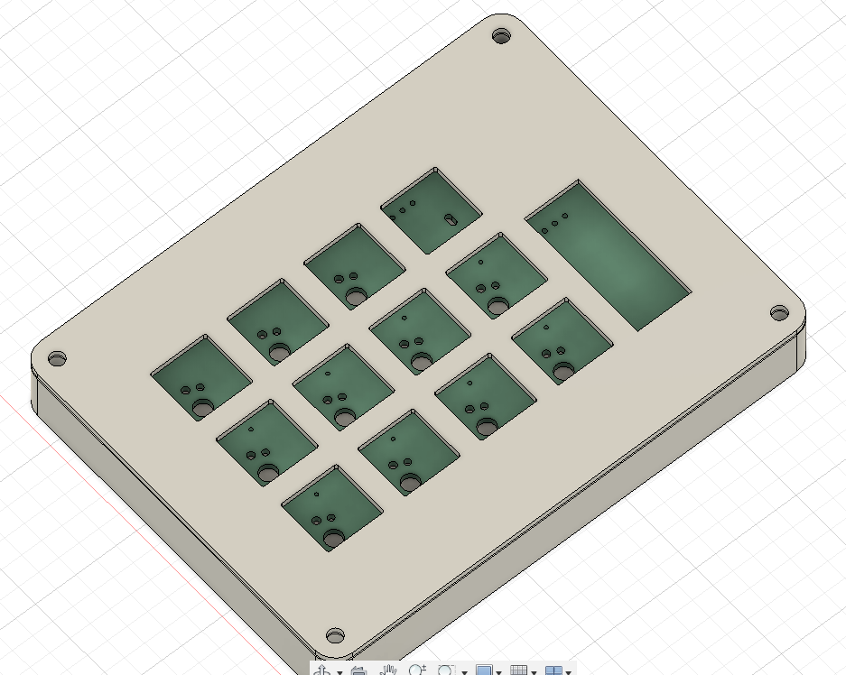
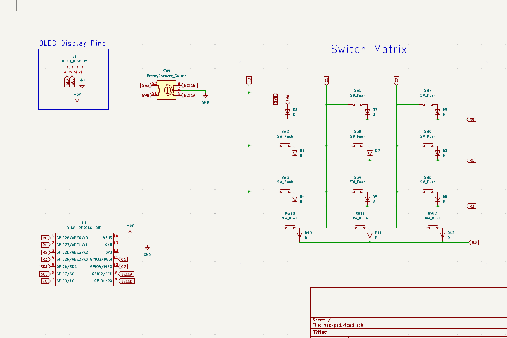
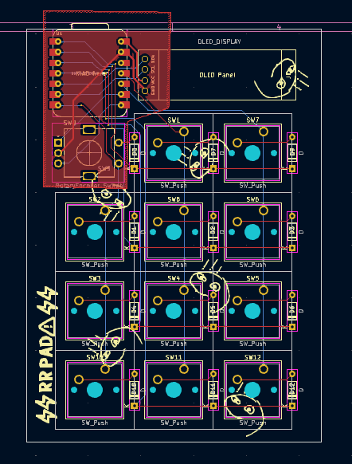

# rrpad
macropad

Its a 11 key macropad with a rotary encoder and an OLED Display. It uses KMK firmware

## Bill of Materials (BOM)
Qty	Name
1	Case top and bottom
11	Cherry MX switches
12	1N4148 diodes
11	Blank DSA white keycaps
1	128x32 I2C OLED screen
1	EC11 rotary encoder + knob
1	PCB
1	Seeed Studio XIAO RP2040
4	M3x16mm screws
4	M3 Heatset Inserts

## CAD:

## Schematic:

## PCB:
